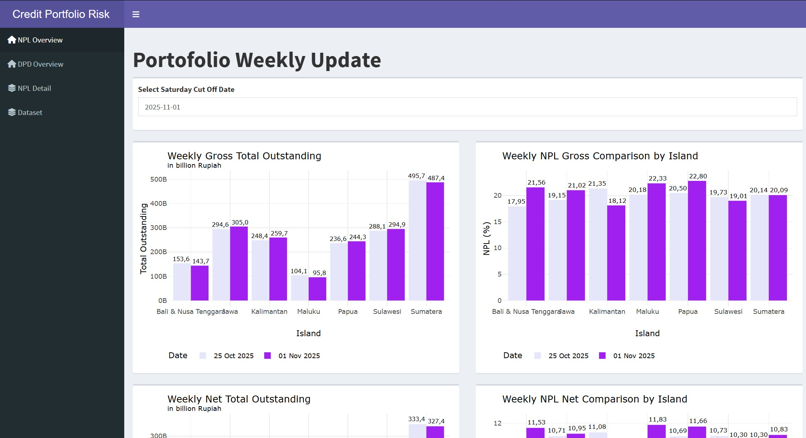

# 📈⚠️ Credit Portfolio Risk Monitoring & Automation Dashboard  

An interactive risk monitoring dashboard that uncovers **credit portfolio quality, delinquency trends, and loan performance patterns across Indonesia**, built using **R and Shiny**.  



---

## 🚀 Overview  
The Credit Portfolio Risk Monitoring & Automation Dashboard is an interactive analytics project developed to support **credit risk monitoring, portfolio analysis, and reporting automation** for financial institutions.  

The main goal of this project was to design and develop an interactive dashboard using **R and Shiny**, delivering **real-time portfolio monitoring**, **automated reporting**, and **clear risk insights** for better decision-making.  

The dashboard provides insights into:  
- 📈 **Credit Portfolio Performance** → Monitor portfolio quality across Gross, Net, and External portfolios.  
- ⚠️ **Credit Risk Indicators** → Track Days Past Due (DPD) buckets, Non-Performing Loan (NPL) ratios, and delinquency movements.  
- 🌍 **Regional Portfolio Monitoring** → Analyze portfolio performance across 7 islands and 37 regions in Indonesia.  
- 🔄 **Flow Rate Analysis** → Observe account migration between delinquency buckets to detect early risk signals.  
- 🤖 **Reporting Automation** → Reduce manual reporting effort through automated data processing and monitoring workflows.  

The dashboard emphasizes **automation, operational efficiency, and actionable risk analytics** to support proactive portfolio management.  

---

## 📈 Live Dashboard & HTML Report  

- 💻 [Interactive Dashboard (R Shiny)](https://zahranuranisah.shinyapps.io/Credit_Portfolio_Risk_Monitoring_Dashboard/)  
- 🌐 [HTML Report – Code & Walkthrough](https://zahraa02.github.io/Credit-Portfolio-Risk-Monitoring-Automation-Dashboard/)

---

## 💼 Business Questions Examples  
- "Which regions or islands contribute the highest credit risk exposure across Gross, Net, and External portfolios?"  
- "How do DPD bucket movements and flow rates indicate worsening or improving portfolio quality over time?"  
- "Which areas show increasing NPL trends and require early intervention from risk management teams?"  
- "How can automated reporting improve operational efficiency and reduce manual monitoring efforts?"  

---

## 📈 Key Insights  

- **Integrated Credit Portfolio Monitoring**  
  - Consolidated Gross, Net, and External portfolio data into a single monitoring dashboard across multiple operational regions in Indonesia.  
  - Enabled centralized visibility into portfolio quality and delinquency trends for faster analysis and reporting.  

- **Automation & Operational Efficiency**  
  - Automated portfolio monitoring and reporting workflows, reducing manual reporting effort by up to **95%**.  
  - Improved reporting speed, consistency, and accessibility for stakeholders and risk teams.  

- **DPD & NPL Risk Tracking**  
  - Monitored loan performance using DPD buckets and NPL indicators to identify early warning signs of portfolio deterioration.  
  - Helped support proactive credit risk mitigation and portfolio management strategies.  

- **Flow Rate Movement Analysis**  
  - Visualized account migration across delinquency buckets to detect transitions toward higher-risk categories.  
  - Supported risk teams in identifying deteriorating accounts before they became non-performing loans.  

---

## 🧱 Project Workflow  

1. **Environment & Library Setup**  
   - Preparation of R environment and required libraries for analytics and dashboard development.  

2. **Data Collection & Integration**  
   - Imported and combined Gross, Net, and External portfolio datasets from multiple Excel files.  
   - Automated dataset consolidation using folder-based file ingestion.  

3. **Data Cleaning & Preprocessing**  
   - Data cleansing and type conversion  
   - Handling missing values and duplicate records  
   - Date transformation and feature engineering  
   - Standardizing portfolio and regional information  

4. **Risk Analytics & Visualization**  
   - Portfolio quality monitoring using DPD and NPL indicators  
   - Regional and branch-level performance analysis  
   - Flow rate and delinquency trend visualization  

5. **Dashboard Development & Automation**  
   - Interactive dashboard creation using Shiny  
   - Automated monitoring workflows for operational reporting  
   - Responsive layout and visualization design for stakeholder reporting  

---

## 📂 Dataset Summary  

The datasets contain credit portfolio monitoring data across **Gross, Net, and External** portfolios in Indonesia.  
The data supports risk monitoring activities through information related to delinquency buckets, outstanding balances, account volumes, and regional operations.  

| Variable | Description |
|-----------|-------------|
| `cut_off_date` | Date when the data was extracted or recorded |
| `island` | Main island or geographical region |
| `region` | Operational region under each island |
| `area` | Operational area supervising branches |
| `branch` | Branch or operational unit |
| `bucket` | Delinquency bucket category based on DPD ranges |
| `noa` | Number of accounts in the portfolio |
| `outstanding_amount` | Total outstanding loan balance |

---

## 🧠 Technical Stack  

- **Language:** R  
- **Framework:** Shiny  
- **Libraries:** ggplot2, dplyr, tidyverse, plotly, lubridate, readxl, ggpubr, scales, purrr  
- **IDE:** RStudio  

---

## 💡 Why This Matters  

This dashboard transforms raw credit portfolio data into **real-time, actionable risk insights** for monitoring loan quality and delinquency trends.  

By automating reporting workflows and centralizing portfolio analytics, it helps improve operational efficiency, strengthen credit risk monitoring, and support proactive decision-making in financial institutions.  

Beyond this specific use case, the project demonstrates how **data analytics, automation, and dashboard development** can modernize traditional risk monitoring processes, reducing manual effort while improving visibility into portfolio health and emerging risks.  

---

## 👩🏻‍💻 Author  

**Zahra Nur Anisah** – Data Science Enthusiast  
Passionate about transforming raw data into meaningful business insights through analytics, automation, and visualization.  

📧 **Email:** [zahranuranisah@gmail.com](mailto:zahranuranisah@gmail.com)  
💼 **LinkedIn:** [linkedin.com/in/zahranuranisah](https://www.linkedin.com/in/zahranuranisah)  
```
